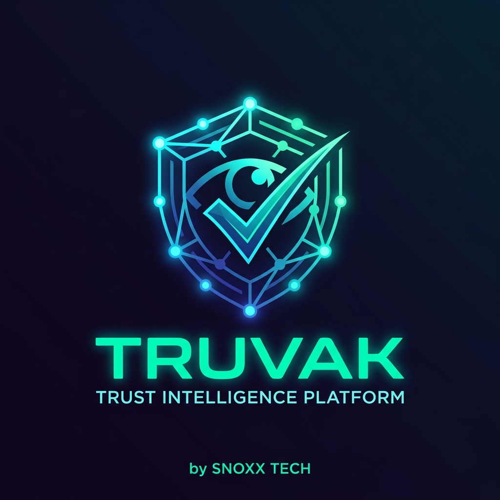

<div align="center">
  
  
  # Truvak
  ### AI-Powered Risk Intelligence for E-commerce Operations
  
  <p>
    
    
    
    
    
    
  </p>

  <p>
    A production-style platform for fraud-risk scoring, review intelligence, seller trust insights, and customer-side spending/watchlist analytics.
  </p>

  <p>
    <i>Developed By <b>Snoxx Tech</b></i>
  </p>
</div>

---

## 🌟 Why Truvak?

Truvak helps detect risk early and convert raw marketplace activity into actionable trust signals:

- **🛡️ RTO Risk Scoring** for orders before shipment.
- **🔍 Review Integrity Analysis** with robust explainability.
- **💡 Customer Trust Features** such as spend trends, watchlists, and price intelligence.
- **🔌 Contextual Browser Extension** for seamless marketplace integration.
- **🗄️ Database Portability**: Full compatibility with local SQLite for rapid prototyping and Supabase PostgreSQL for scalable production logic.

---

## 📦 What Is Included

### ⚙️ Core Backend (FastAPI)

- RTO scoring endpoints and rule engine.
- Merchant authentication, outcome logging, and order history APIs.
- Dedicated routers for Review Intelligence, Customer Authentication, and Analytics.
- Specialized APIs for Price Intelligence, Watchlists, and Seller Intelligence.
- Selector health telemetry endpoint for extension reliability.

### 💻 Frontend Experiences

- **Merchant Dashboard** (`dashboard/`): Intelligent React + Vite SPA built to help merchants visualize real-time RTO risk.
- **Customer App** (`customer/`): React + Vite portal for customer-centric analytics and spending intel. Fully consumes backend APIs for robust data fetching.

### 🧩 Browser Extension

- A fully functional **Manifest V3 Extension** located in `extension/`.
- Embedded content scripts for seamless integration with Amazon and Flipkart.
- Hardened anti-blocking mechanisms (retry/caching capabilities, selector health telemetry, and CAPTCHA-aware resume flows).

### 🧠 Data and ML Pipeline

- Includes comprehensive PIN tier data and targeted feature schemas under `data/`.
- Ready-to-go Machine Learning scripts deployed in `ml/`.
- Core RTO predictive model (`ml/rto_model_v1.pkl`) seamlessly loaded at instance startup.

---

## 🚀 Latest Integrations

### Data Persistence (Supabase / PostgreSQL)

- **Dynamic Connection Routing**: Driven via the `DATABASE_URL` environment configuration.
- **Fully Interchangeable SQL Engines**:
  - Run **SQLite** locally or offline.
  - Switch to **PostgreSQL/Supabase** for enterprise features.
- Powerful migration tooling included:
  - `scripts/export_sqlite.py`
  - `scripts/migrate_to_supabase.py`
  - `scripts/test_supabase_connection.py`
- Battle-tested migration logic handles strict boolean types, column mismatches, JSON/JSONB normalization, and target alias mapping out of the box.

### Customer Data Hardening & Security

- New endpoint availability: `GET /v1/customer/orders/recent`.
- Upgraded UI interactions fetching via securely marshaled backend API payloads as opposed to raw database hooks.

---

## 📂 Repository Architecture

```text
truvak/
├── backend/                 # FastAPI logic routing layer
├── customer/                # User dashboard (React + Vite)
├── dashboard/               # Risk evaluation hub (React + Vite)
├── docs/                    # Architectural images and docs
├── extension/               # Browser context scripts (MV3)
├── ml/                      # Data modeling and intelligence algorithms
├── data/                    # Model resources, pin maps
├── scripts/                 # Administration and migration scripts
├── requirements.txt         # Core backend python dependencies
├── .env.example             # Base scaffolding variables
└── start.bat                # Unified application launcher
```

---

## ⚡ Quick Start (Windows)

### 1. Prerequisites Set-up

Ensure your system aligns with:
- Python 3.9+
- Node.js 18+
- npm (Node Package Manager)
- ngrok *(optional; useful for Shopify/webhooks simulation)*

### 2. Scaffold the Backend Environment

```powershell
cd truvak # or your containing folder
python -m venv venv
.\venv\Scripts\activate
python -m pip install -r requirements.txt
```

### 3. Establish Configurations

Copy `.env.example` into a new `.env` file at the root. Set baseline properties:

**Standard Local Spin-up (SQLite):**
```env
DATABASE_URL=sqlite:///data/trust.db
JWT_SECRET=super_secret_token
CUSTOMER_SALT=super_secret_salt
```

**Production-grade (PostgreSQL/Supabase):**
```env
DATABASE_URL=postgresql://postgres:<PASSWORD>@<HOST>:5432/postgres?sslmode=require
SUPABASE_URL=https://<PROJECT>.supabase.co
SUPABASE_ANON_KEY=<ANON_KEY>
SUPABASE_SERVICE_ROLE_KEY=<SERVICE_ROLE_KEY>
```

### 4. Build the Frontends

```powershell
cd customer
npm install
cd ..\dashboard
npm install
cd ..
```

*Note: Verify `customer/.env` includes `VITE_API_URL=http://127.0.0.1:8000` (can be copied from `customer/.env.example`).*

### 5. Launch the Platform

**The One-click Approach:**
```powershell
start.bat
```

**The Manual Approach:**
```powershell
# Term 1: Run Backend
.\venv\Scripts\python.exe -m uvicorn backend.main:app --reload --port 8000

# Term 2: Run Customer UX
cd customer
npm run dev

# Term 3: Run Merchant Hub
cd dashboard
npm run dev
```

---

## 🌐 API Snapshot

Main application nodes from `backend/main.py`:

- **Platform Health:** `GET /healthz` | `GET /health`
- **Core Operations:** `POST /v1/login` | `POST /v1/score` | `POST /v1/outcome`
- **Risk Evaluation:** `GET /v1/scores/{merchant_id}` | `GET /v1/orders` | `GET /v1/rules/{...}` | `POST /v1/rules/{...}/threshold`
- **Geospatial Risk:** `GET /v1/area/intelligence/{pin_code}`
- **Webhooks:** `POST /v1/shopify/webhook` | `GET /v1/shopify/orders`

Domain-specific Routers:
- `/v1/reviews/*`
- `/v1/customer/*`
- `/v1/watchlist/*`
- `/v1/prices/*`
- `/v1/seller/*`
- `/v1/health/*`

**API playground available at** [http://127.0.0.1:8000/docs](http://127.0.0.1:8000/docs) when running locally.

---

## 🛡️ Best Practices & Quality Control

- ✨ Ensure `.env` is strongly sequestered; never commit actual secrets into your VCS.
- ✨ Run python scripts utilizing `python -m <package>` inside a populated virtual environment.
- ✨ Prefer mediated routing configurations natively exposed via FastAPI rather than direct front-end database interactions.

---

## 📜 Copyright & Licensing

**Developed By Snoxx Tech**  
*Copyright © 2026 Snoxx Tech. All Rights Reserved.*

Proprietary project. All rights reserved by the project owner/team unless explicitly stated otherwise. Unauthorized copying of this file, via any medium is strictly prohibited.
